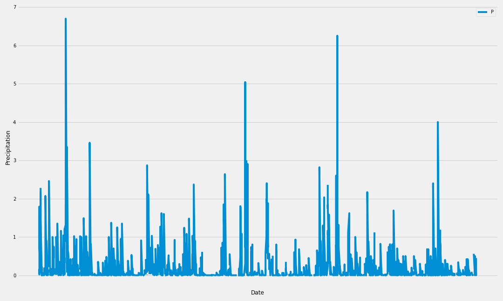
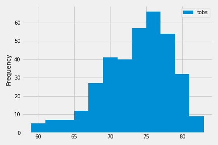
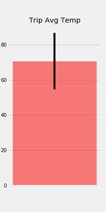

# SQLAlchemy - Surfs Up!

Are you planning a trip to treat yourself to long holiday vacation. This project helps with the trip planning and climate analysis on the area.

## 1 - Climate Analysis and Exploration

 Python and SQLAlchemy are used to do basic climate analysis and data exploration of the climate database. All the following analysis are completed using SQLAlchemy ORM queries, Pandas, and Matplotlib.

* [starter notebook](climate_starter.ipynb) and [hawaii.sqlite](Resources/hawaii.sqlite) are used for  climate analysis and data exploration.

* Choose a start date and end date for your trip. Make sure that your vacation range is approximately 3-15 days total.

* SQLAlchemy `create_engine` is used to connect to your sqlite database.

* SQLAlchemy `automap_base()` to reflect tables into classes and save a reference to those classes called `Station` and `Measurement`.

### Precipitation Analysis

* 12 Months of precipitation data is queried for the analysis.

* Selected only the `date` and `prcp` values.

* Loaded the query results into a Pandas DataFrame and set the index to the date column.

* Sorted the DataFrame values by `date`.

* Plotted the results using the DataFrame `plot` method.

  

* Pandas is used to print the summary statistics for the precipitation data.

### Station Analysis

* Total number of stations is queried. 

* Query to find the most active stations.

  * List the stations and observation counts in descending order.

  * Which station has the highest number of observations?

* Query to retrieve the last 12 months of temperature observation data (tobs).

  * Filter by the station with the highest number of observations.

  * Plot the results as a histogram with `bins=12`.

    

- - -

## 2 - Climate App

Initial Analysis is completed in Step 1 and Flask API has been designed for the queries that were developed in Step 1.

* FLASK is used to create your routes.

### Routes

* `/`

  * Home page.

  * This lists all routes that are available.

* `/api/v1.0/precipitation`

  * This API is to convert the query results to a Dictionary using `date` as the key and `prcp` as the value.

  * JSON representation of the dictionary is returned

* `/api/v1.0/stations`

  * This API is to return a JSON list of stations from the dataset.

* `/api/v1.0/tobs`
  * This API is to query for the dates and temperature observations from a year from the last data point.
  * JSON list of Temperature Observations (tobs) for the previous year is returned.

* `/api/v1.0/<start>` and `/api/v1.0/<start>/<end>`

  * Returns a JSON list of the minimum temperature, the average temperature, and the max temperature for a given start or start-end range.

  * When given the start only, calculate `TMIN`, `TAVG`, and `TMAX` for all dates greater than and equal to the start date.

  * When given the start and the end date, calculate the `TMIN`, `TAVG`, and `TMAX` for dates between the start and end date inclusive.

- - -

### Future Recommended Analyses

### Temperature Analysis I

* Hawaii is reputed to enjoy mild weather all year. Is there a meaningful difference between the temperature in, for example, June and December?

* SQLAlchemy or pandas's `read_csv()` will be used to perform this portion.

* Identify the average temperature in June at all stations across all available years in the dataset. Do the same for December temperature.

* Use the t-test to determine whether the difference in the means, if any, is statistically significant. Will you use a paired t-test, or an unpaired t-test? Why?

### Temperature Analysis II

* The starter notebook contains a function called `calc_temps` that will accept a start date and end date in the format `%Y-%m-%d` and return the minimum, average, and maximum temperatures for that range of dates.

* Use the `calc_temps` function to calculate the min, avg, and max temperatures for your trip using the matching dates from the previous year (i.e., use "2017-01-01" if your trip start date was "2018-01-01").

* Plot the min, avg, and max temperature from your previous query as a bar chart.

  * Use the average temperature as the bar height.

  * Use the peak-to-peak (tmax-tmin) value as the y error bar (yerr).

    

### Daily Rainfall Average

* Calculate the rainfall per weather station using the previous year's matching dates.

* Calculate the daily normals. Normals are the averages for the min, avg, and max temperatures.

* You are provided with a function called `daily_normals` that will calculate the daily normals for a specific date. This date string will be in the format `%m-%d`. Be sure to use all historic tobs that match that date string.

* Create a list of dates for your trip in the format `%m-%d`. Use the `daily_normals` function to calculate the normals for each date string and append the results to a list.

* Load the list of daily normals into a Pandas DataFrame and set the index equal to the date.

* Use Pandas to plot an area plot (`stacked=False`) for the daily normals.

  

